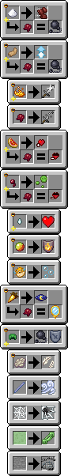
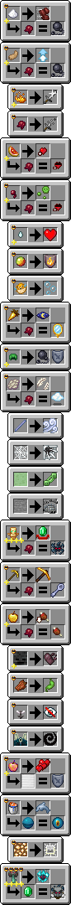
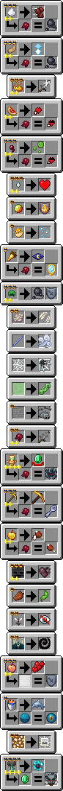

## Minecraft Cauldron Brewing Datapack

<em>Created by FancyPotatOS</em>

A way to brew potions using the cauldron like a witch, and allowing custom potion recipes!

To brew a potion, throw the ingredient into a cauldron with the water bottle/potion, and activate it by dropping in an amethyst shard

    
Recipes

    

    
Extended Recipes

    
Activate by running <code>/function cauldronbrewing:brewing/init/add_custom</code>

    

    
Crazy Recipes

    
Activate by running <code>/function cauldronbrewing:brewing/init/generous_balance</code>

    

